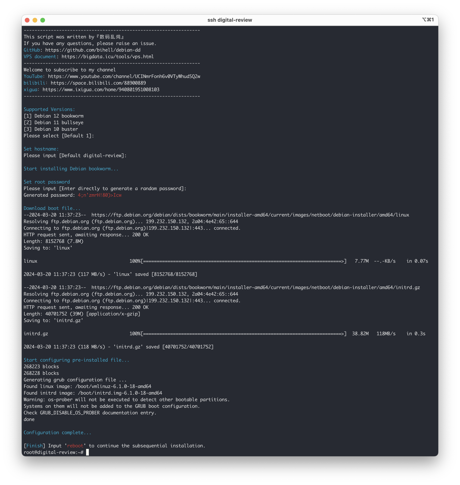

# Debian-DD

A Debian reinstallation script, currently only supports X86 64Bit platforms, reinstallation requires the original system to be debian or ubuntu. the script will not set ipv6.

## 0x01 Usage

```
bash <(curl -sL https://github.com/bihell/debian-dd/raw/main/debian-dd)
```

## 0x02 VPS purchase

My VPS Documentation：[https://bigdata.icu/tools/vps.html](https://bigdata.icu/tools/vps.html)

## 0x03 Subscribe to my channel

[YouTube](https://www.youtube.com/channel/UCINmrFonh6v0VTyWhudSQ2w)、[bilibili](https://space.bilibili.com/88900889)、[xigua](https://www.ixigua.com/home/940801951008103)

## 0x04 ScreenShot


